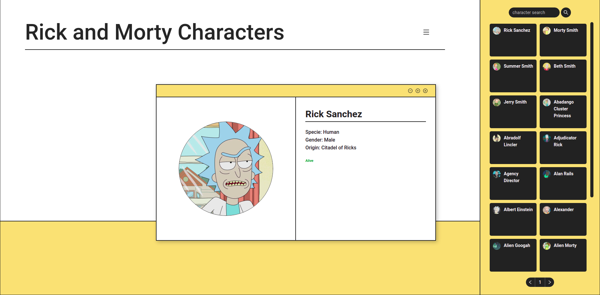

# Rick and Morty
</img>

## Description

  This is a screen to show character information from the Rick and Morty animated series built with React Js. Such information can be the name of the characters, their species, gender and origin in the universe of the series.

## Features

<ul>
  <li>Characters List: There is a right side menu with familiar characters from the series listed on clickable cards.</li>
  <li>Search by Name: There is a search box on the right side menu that allows you to search for specific characters by their name.</li>
  <li>Details view: There is a central viewing area for viewing the character information selected in the side menu.</li>
</ul>

## API

  The API used can be found at <a href="https://rickandmortyapi.com/">The Rick and Morty API</a>. It has all the information used here, as well as others not explored in this project.

